  <picture>
    <source media="(prefers-color-scheme: dark)" srcset="./assets/hero-dark.svg">
    <source media="(prefers-color-scheme: light)" srcset="./assets/hero-light.svg">
    <!-- Fallback if SVG fails -->
    
  </picture>

 

  
  
  
  
  

 

## ── Engineering Focus

I architect and scale **distributed backend systems** and **generative AI infrastructure**. Currently pursuing a B.S. in Computer Science & Data Analytics at IIT Patna (2024–2028), I build production-grade applications capable of handling 100K+ concurrent users with high availability and low latency.

**Core Philosophy:** Measure everything. Ship iteratively. Keep the architecture as simple as the scale permits.

 

## ── Architecture & Systems

### 1. DocMateX (Healthcare Networking Engine)
**Scale:** Designed for 100,000+ users.
**Architecture:** Monorepo architecture separating the core API layer, real-time messaging workers, and the frontend client. Utilizes a Redis-backed queue system for asynchronous job processing (notifications, AI mentor matching) to ensure the main event loop remains unblocked.
* **Stack:** NestJS, Next.js 15, Prisma, PostgreSQL, Redis, BullMQ, Socket.IO.

### 2. Leazy Learn (Multimodal RAG AI Tutor)
**Complexity:** Orchestrating a high-throughput retrieval pipeline for educational contexts.
**Architecture:** Implements a vector-based Retrieval-Augmented Generation (RAG) system using `pgvector`. It parses unstructured NCERT data, chunking and embedding it to serve highly contextual answers grounded in both text and visual diagrams. 119+ production API routes.
* **Stack:** Next.js, Supabase, pgvector, Groq / OpenAI, LiveKit (WebRTC), Razorpay.

### 3. GeoAI Reconstruction Engine (ISRO BAH 2026)
**Complexity:** Fusing Multi-Sensor Satellite Data (SAR).
**Architecture:** Implemented a generative cloud-removal engine leveraging Vision Transformers (ViT) and Diffusion models. Handled large-scale LISS-IV remote sensing data, optimizing inference time for cloud environments.
* **Stack:** PyTorch, ViT, Diffusion Models, OpenCV.

 

## ── Technology Stack

<table>
  <tr>
    <td width="50%" valign="top">
      <h3>Infrastructure & Backend</h3>
      <ul>
        <li><b>NestJS & Node.js:</b> Building scalable, heavily-typed enterprise APIs.</li>
        <li><b>PostgreSQL & Prisma:</b> Relational data modeling and type-safe ORM queries.</li>
        <li><b>Redis & BullMQ:</b> Caching strategies and distributed message queues.</li>
        <li><b>Docker & AWS:</b> Containerization and cloud deployment.</li>
      </ul>
    </td>
    <td width="50%" valign="top">
      <h3>AI & Data Engineering</h3>
      <ul>
        <li><b>PyTorch & Python:</b> Training and fine-tuning generative models.</li>
        <li><b>pgvector:</b> High-performance similarity search for RAG pipelines.</li>
        <li><b>Diffusion Models & ViT:</b> Applied research in image reconstruction.</li>
        <li><b>Pandas & Scikit-learn:</b> Data analysis and applied machine learning.</li>
      </ul>
    </td>
  </tr>
  <tr>
    <td width="50%" valign="top">
      <h3>Frontend & Mobile Clients</h3>
      <ul>
        <li><b>Next.js & React:</b> Edge-rendered, highly performant web applications.</li>
        <li><b>Flutter & Dart:</b> Cross-platform mobile development with native performance.</li>
        <li><b>TypeScript:</b> Enforcing strict end-to-end type safety.</li>
      </ul>
    </td>
    <td width="50%" valign="top">
      <h3>Current Active Learning</h3>
      <ul>
        <li>Advanced Distributed Systems Design (Paxos/Raft algorithms).</li>
        <li>Optimizing LLM inference costs and latency in production.</li>
        <li>Daily DSA problem solving on LeetCode.</li>
      </ul>
    </td>
  </tr>
</table>

 

## ── Open Source & Analytics

  <picture>
    <source media="(prefers-color-scheme: dark)" srcset="https://raw.githubusercontent.com/ravi-c029/ravi-c029/output/github-contribution-grid-snake-dark.svg">
    <source media="(prefers-color-scheme: light)" srcset="https://raw.githubusercontent.com/ravi-c029/ravi-c029/output/github-contribution-grid-snake.svg">
    
  </picture>

 

<table width="100%" border="0">
  <tr>
    <td width="50%" align="center">
      
    </td>
    <td width="50%" align="center">
      
    </td>
  </tr>
</table>

 

  
Open to SDE Internships • Data Science Roles • Research Collaborations

  <a href="mailto:ravi.keshari029@gmail.com"><b>Let's build something exceptional.</b></a>

